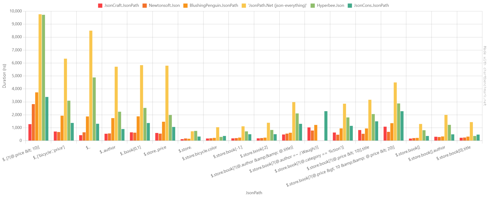
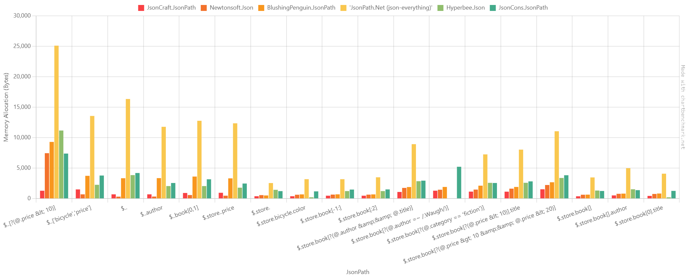

# JsonCraft.JsonPath

A lightweight .NET library for querying JSON documents using JSONPath expressions with System.Text.Json.

This implementation is inspired by and based on the JSONPath implementation in [Newtonsoft.Json](https://github.com/JamesNK/Newtonsoft.Json), ported to work with System.Text.Json with modern optimizations.

## Installation

The package is available on [NuGet](https://www.nuget.org/packages/JsonCraft.JsonPath).

Using the .NET CLI:
```sh
dotnet add package JsonCraft.JsonPath
```

## Usage

The library provides extension methods for `JsonElement` and `JsonDocument` to query JSON using JSONPath expressions:

```csharp
using System.Text.Json;
using JsonCraft.JsonPath;

// Parse JSON
string json = @"{
    ""store"": {
        ""book"": [
            {
                ""category"": ""reference"",
                ""author"": ""Nigel Rees"",
                ""title"": ""Sayings of the Century"",
                ""price"": 8.95
            },
            {
                ""category"": ""fiction"", 
                ""author"": ""Evelyn Waugh"",
                ""title"": ""Sword of Honour"",
                ""price"": 12.99
            }
        ]
    }
}";

JsonDocument document = JsonDocument.Parse(json);

// Select single token
JsonElement? title = document.SelectToken("$.store.book[0].title");
Console.WriteLine(title?.GetString()); // "Sayings of the Century"

// Select multiple tokens
IEnumerable<JsonElement> authors = document.SelectTokens("$.store.book[*].author");
foreach(var author in authors) {
    Console.WriteLine(author.GetString());
}

// Query with filter
var expensiveBooks = document.SelectTokens("$.store.book[?(@.price > 10)]");
```

## Benchmark Results

```
BenchmarkDotNet v0.14.0, Windows 11 (10.0.26100.2605)
13th Gen Intel Core i9-13900HX, 1 CPU, 32 logical and 24 physical cores
.NET SDK 9.0.101
  [Host]     : .NET 9.0.0 (9.0.24.52809), X64 RyuJIT AVX2
  DefaultJob : .NET 9.0.0 (9.0.24.52809), X64 RyuJIT AVX2
```

| Method                           | JsonPath                                                        |           Mean |        Error |         Ratio |  Allocated | Alloc Ratio |
| -------------------------------- | --------------------------------------------------------------- | -------------: | -----------: | ------------: | ---------: | ----------: |
| **JsonCraft.JsonPath**           | **$..[?(@.price &lt; 10)]**                                     | **1,280.3 ns** | **12.31 ns** |  **baseline** | **1288 B** |        **** |
| Newtonsoft.Json                  | $..[?(@.price &lt; 10)]                                         |     2,827.0 ns |     20.44 ns |  2.21x slower |     7456 B |  5.79x more |
| BlushingPenguin.JsonPath         | $..[?(@.price &lt; 10)]                                         |     3,735.8 ns |     11.17 ns |  2.92x slower |     9304 B |  7.22x more |
| 'JsonPath.Net (json-everything)' | $..[?(@.price &lt; 10)]                                         |     9,767.4 ns |    102.71 ns |  7.63x slower |    25112 B | 19.50x more |
| Hyperbee.Json                    | $..[?(@.price &lt; 10)]                                         |     9,725.4 ns |     46.37 ns |  7.60x slower |    11176 B |  8.68x more |
| JsonCons.JsonPath                | $..[?(@.price &lt; 10)]                                         |     3,381.1 ns |     12.81 ns |  2.64x slower |     7392 B |  5.74x more |
|                                  |                                                                 |                |              |               |            |             |
| **JsonCraft.JsonPath**           | **$..['bicycle','price']**                                      |   **710.5 ns** |  **4.14 ns** |  **baseline** | **1504 B** |        **** |
| Newtonsoft.Json                  | $..['bicycle','price']                                          |       673.4 ns |      3.27 ns |  1.06x faster |      696 B |  2.16x less |
| BlushingPenguin.JsonPath         | $..['bicycle','price']                                          |     1,932.0 ns |      6.73 ns |  2.72x slower |     3736 B |  2.48x more |
| 'JsonPath.Net (json-everything)' | $..['bicycle','price']                                          |     6,337.8 ns |     37.76 ns |  8.92x slower |    13568 B |  9.02x more |
| Hyperbee.Json                    | $..['bicycle','price']                                          |     3,092.3 ns |     12.16 ns |  4.35x slower |     2264 B |  1.51x more |
| JsonCons.JsonPath                | $..['bicycle','price']                                          |     1,375.4 ns |      6.62 ns |  1.94x slower |     3784 B |  2.52x more |
|                                  |                                                                 |                |              |               |            |             |
| **JsonCraft.JsonPath**           | **$..***                                                        |   **428.1 ns** |  **2.20 ns** |  **baseline** |  **696 B** |        **** |
| Newtonsoft.Json                  | $..*                                                            |       649.4 ns |      3.32 ns |  1.52x slower |      320 B |  2.17x less |
| BlushingPenguin.JsonPath         | $..*                                                            |     1,875.3 ns |      7.17 ns |  4.38x slower |     3344 B |  4.80x more |
| 'JsonPath.Net (json-everything)' | $..*                                                            |     8,502.4 ns |     68.05 ns | 19.86x slower |    16352 B | 23.49x more |
| Hyperbee.Json                    | $..*                                                            |     4,887.0 ns |     13.77 ns | 11.41x slower |     3856 B |  5.54x more |
| JsonCons.JsonPath                | $..*                                                            |     1,310.8 ns |      4.54 ns |  3.06x slower |     4200 B |  6.03x more |
|                                  |                                                                 |                |              |               |            |             |
| **JsonCraft.JsonPath**           | **$..author**                                                   |   **539.3 ns** |  **3.95 ns** |  **baseline** |  **696 B** |        **** |
| Newtonsoft.Json                  | $..author                                                       |       563.7 ns |      3.96 ns |  1.05x slower |      336 B |  2.07x less |
| BlushingPenguin.JsonPath         | $..author                                                       |     1,747.4 ns |      9.95 ns |  3.24x slower |     3360 B |  4.83x more |
| 'JsonPath.Net (json-everything)' | $..author                                                       |     5,715.9 ns |     21.23 ns | 10.60x slower |    11784 B | 16.93x more |
| Hyperbee.Json                    | $..author                                                       |     2,240.2 ns |      8.04 ns |  4.15x slower |     2056 B |  2.95x more |
| JsonCons.JsonPath                | $..author                                                       |       902.4 ns |      6.01 ns |  1.67x slower |     2560 B |  3.68x more |
|                                  |                                                                 |                |              |               |            |             |
| **JsonCraft.JsonPath**           | **$..book[0,1]**                                                |   **648.3 ns** |  **2.76 ns** |  **baseline** |  **920 B** |        **** |
| Newtonsoft.Json                  | $..book[0,1]                                                    |       622.9 ns |      3.66 ns |  1.04x faster |      584 B |  1.58x less |
| BlushingPenguin.JsonPath         | $..book[0,1]                                                    |     1,881.7 ns |      4.69 ns |  2.90x slower |     3616 B |  3.93x more |
| 'JsonPath.Net (json-everything)' | $..book[0,1]                                                    |     5,835.7 ns |     51.78 ns |  9.00x slower |    12776 B | 13.89x more |
| Hyperbee.Json                    | $..book[0,1]                                                    |     2,533.8 ns |      6.94 ns |  3.91x slower |     2056 B |  2.23x more |
| JsonCons.JsonPath                | $..book[0,1]                                                    |     1,367.8 ns |      3.97 ns |  2.11x slower |     3168 B |  3.44x more |
|                                  |                                                                 |                |              |               |            |             |
| **JsonCraft.JsonPath**           | **$.store..price**                                              |   **598.6 ns** |  **3.00 ns** |  **baseline** |  **952 B** |        **** |
| Newtonsoft.Json                  | $.store..price                                                  |       549.1 ns |      2.93 ns |  1.09x faster |      472 B |  2.02x less |
| BlushingPenguin.JsonPath         | $.store..price                                                  |     1,467.2 ns |      5.99 ns |  2.45x slower |     3320 B |  3.49x more |
| 'JsonPath.Net (json-everything)' | $.store..price                                                  |     5,796.5 ns |     32.47 ns |  9.68x slower |    12360 B | 12.98x more |
| Hyperbee.Json                    | $.store..price                                                  |     1,986.1 ns |     14.87 ns |  3.32x slower |     1792 B |  1.88x more |
| JsonCons.JsonPath                | $.store..price                                                  |     1,063.2 ns |      5.52 ns |  1.78x slower |     2472 B |  2.60x more |
|                                  |                                                                 |                |              |               |            |             |
| **JsonCraft.JsonPath**           | **$.store.***                                                   |   **121.3 ns** |  **0.59 ns** |  **baseline** |  **384 B** |        **** |
| Newtonsoft.Json                  | $.store.*                                                       |       174.3 ns |      1.31 ns |  1.44x slower |      568 B |  1.48x more |
| BlushingPenguin.JsonPath         | $.store.*                                                       |       152.8 ns |      0.87 ns |  1.26x slower |      512 B |  1.33x more |
| 'JsonPath.Net (json-everything)' | $.store.*                                                       |       728.4 ns |      3.47 ns |  6.01x slower |     2552 B |  6.65x more |
| Hyperbee.Json                    | $.store.*                                                       |       758.0 ns |      1.47 ns |  6.25x slower |     1440 B |  3.75x more |
| JsonCons.JsonPath                | $.store.*                                                       |       323.4 ns |      1.21 ns |  2.67x slower |     1224 B |  3.19x more |
|                                  |                                                                 |                |              |               |            |             |
| **JsonCraft.JsonPath**           | **$.store.bicycle.color**                                       |   **171.0 ns** |  **1.01 ns** |  **baseline** |  **384 B** |        **** |
| Newtonsoft.Json                  | $.store.bicycle.color                                           |       189.8 ns |      0.94 ns |  1.11x slower |      632 B |  1.65x more |
| BlushingPenguin.JsonPath         | $.store.bicycle.color                                           |       220.2 ns |      1.40 ns |  1.29x slower |      688 B |  1.79x more |
| 'JsonPath.Net (json-everything)' | $.store.bicycle.color                                           |     1,044.0 ns |      5.20 ns |  6.11x slower |     3184 B |  8.29x more |
| Hyperbee.Json                    | $.store.bicycle.color                                           |       294.5 ns |      0.88 ns |  1.72x slower |      208 B |  1.85x less |
| JsonCons.JsonPath                | $.store.bicycle.color                                           |       367.3 ns |      1.11 ns |  2.15x slower |     1184 B |  3.08x more |
|                                  |                                                                 |                |              |               |            |             |
| **JsonCraft.JsonPath**           | **$.store.book[-1:]**                                           |   **181.6 ns** |  **0.62 ns** |  **baseline** |  **472 B** |        **** |
| Newtonsoft.Json                  | $.store.book[-1:]                                               |       202.4 ns |      0.66 ns |  1.11x slower |      656 B |  1.39x more |
| BlushingPenguin.JsonPath         | $.store.book[-1:]                                               |       242.2 ns |      1.44 ns |  1.33x slower |      696 B |  1.47x more |
| 'JsonPath.Net (json-everything)' | $.store.book[-1:]                                               |     1,112.4 ns |      4.54 ns |  6.12x slower |     3184 B |  6.75x more |
| Hyperbee.Json                    | $.store.book[-1:]                                               |       722.5 ns |      5.19 ns |  3.98x slower |     1232 B |  2.61x more |
| JsonCons.JsonPath                | $.store.book[-1:]                                               |       501.0 ns |      1.52 ns |  2.76x slower |     1480 B |  3.14x more |
|                                  |                                                                 |                |              |               |            |             |
| **JsonCraft.JsonPath**           | **$.store.book[:2]**                                            |   **183.8 ns** |  **0.78 ns** |  **baseline** |  **472 B** |        **** |
| Newtonsoft.Json                  | $.store.book[:2]                                                |       205.5 ns |      0.97 ns |  1.12x slower |      648 B |  1.37x more |
| BlushingPenguin.JsonPath         | $.store.book[:2]                                                |       238.9 ns |      2.11 ns |  1.30x slower |      688 B |  1.46x more |
| 'JsonPath.Net (json-everything)' | $.store.book[:2]                                                |     1,387.6 ns |      7.38 ns |  7.55x slower |     3496 B |  7.41x more |
| Hyperbee.Json                    | $.store.book[:2]                                                |       831.1 ns |      4.65 ns |  4.52x slower |     1232 B |  2.61x more |
| JsonCons.JsonPath                | $.store.book[:2]                                                |       504.1 ns |      1.94 ns |  2.74x slower |     1504 B |  3.19x more |
|                                  |                                                                 |                |              |               |            |             |
| **JsonCraft.JsonPath**           | **$.store.book[?(@.author &amp;&amp; @.title)]**                |   **482.0 ns** |  **1.60 ns** |  **baseline** | **1088 B** |        **** |
| Newtonsoft.Json                  | $.store.book[?(@.author &amp;&amp; @.title)]                    |       549.4 ns |      2.64 ns |  1.14x slower |     1752 B |  1.61x more |
| BlushingPenguin.JsonPath         | $.store.book[?(@.author &amp;&amp; @.title)]                    |       615.8 ns |      2.78 ns |  1.28x slower |     1896 B |  1.74x more |
| 'JsonPath.Net (json-everything)' | $.store.book[?(@.author &amp;&amp; @.title)]                    |     2,980.9 ns |     17.48 ns |  6.18x slower |     8936 B |  8.21x more |
| Hyperbee.Json                    | $.store.book[?(@.author &amp;&amp; @.title)]                    |     2,109.0 ns |      6.68 ns |  4.38x slower |     2856 B |  2.62x more |
| JsonCons.JsonPath                | $.store.book[?(@.author &amp;&amp; @.title)]                    |     1,304.6 ns |     12.17 ns |  2.71x slower |     2944 B |  2.71x more |
|                                  |                                                                 |                |              |               |            |             |
| **JsonCraft.JsonPath**           | **$.store.book[?(@.author =~ /.*Waugh/)]**                      | **1,029.0 ns** |  **4.05 ns** |  **baseline** | **1296 B** |        **** |
| Newtonsoft.Json                  | $.store.book[?(@.author =~ /.*Waugh/)]                          |       787.3 ns |      2.03 ns |  1.31x faster |     1456 B |  1.12x more |
| BlushingPenguin.JsonPath         | $.store.book[?(@.author =~ /.*Waugh/)]                          |     1,218.9 ns |      3.44 ns |  1.18x slower |     1912 B |  1.48x more |
| 'JsonPath.Net (json-everything)' | $.store.book[?(@.author =~ /.*Waugh/)]                          |             NA |           NA |             ? |         NA |           ? |
| Hyperbee.Json                    | $.store.book[?(@.author =~ /.*Waugh/)]                          |             NA |           NA |             ? |         NA |           ? |
| JsonCons.JsonPath                | $.store.book[?(@.author =~ /.*Waugh/)]                          |     2,281.5 ns |     14.75 ns |  2.22x slower |     5224 B |  4.03x more |
|                                  |                                                                 |                |              |               |            |             |
| **JsonCraft.JsonPath**           | **$.store.book[?(@.category == 'fiction')]**                    |   **633.2 ns** |  **2.62 ns** |  **baseline** | **1144 B** |        **** |
| Newtonsoft.Json                  | $.store.book[?(@.category == 'fiction')]                        |       465.2 ns |      1.39 ns |  1.36x faster |     1480 B |  1.29x more |
| BlushingPenguin.JsonPath         | $.store.book[?(@.category == 'fiction')]                        |       951.4 ns |      3.29 ns |  1.50x slower |     2120 B |  1.85x more |
| 'JsonPath.Net (json-everything)' | $.store.book[?(@.category == 'fiction')]                        |     2,856.8 ns |     28.63 ns |  4.51x slower |     7256 B |  6.34x more |
| Hyperbee.Json                    | $.store.book[?(@.category == 'fiction')]                        |     1,799.8 ns |      8.08 ns |  2.84x slower |     2584 B |  2.26x more |
| JsonCons.JsonPath                | $.store.book[?(@.category == 'fiction')]                        |     1,148.2 ns |     10.91 ns |  1.81x slower |     2560 B |  2.24x more |
|                                  |                                                                 |                |              |               |            |             |
| **JsonCraft.JsonPath**           | **$.store.book[?(@.price &lt; 10)].title**                      |   **824.8 ns** |  **3.28 ns** |  **baseline** | **1136 B** |        **** |
| Newtonsoft.Json                  | $.store.book[?(@.price &lt; 10)].title                          |       535.6 ns |      2.70 ns |  1.54x faster |     1632 B |  1.44x more |
| BlushingPenguin.JsonPath         | $.store.book[?(@.price &lt; 10)].title                          |       946.4 ns |      4.74 ns |  1.15x slower |     1912 B |  1.68x more |
| 'JsonPath.Net (json-everything)' | $.store.book[?(@.price &lt; 10)].title                          |     3,163.2 ns |     29.07 ns |  3.84x slower |     8040 B |  7.08x more |
| Hyperbee.Json                    | $.store.book[?(@.price &lt; 10)].title                          |     2,058.6 ns |      6.35 ns |  2.50x slower |     2592 B |  2.28x more |
| JsonCons.JsonPath                | $.store.book[?(@.price &lt; 10)].title                          |     1,498.0 ns |      6.20 ns |  1.82x slower |     2824 B |  2.49x more |
|                                  |                                                                 |                |              |               |            |             |
| **JsonCraft.JsonPath**           | **$.store.book[?(@.price &gt; 10 &amp;&amp; @.price &lt; 20)]** | **1,084.8 ns** |  **5.34 ns** |  **baseline** | **1528 B** |        **** |
| Newtonsoft.Json                  | $.store.book[?(@.price &gt; 10 &amp;&amp; @.price &lt; 20)]     |       687.2 ns |      2.23 ns |  1.58x faster |     2232 B |  1.46x more |
| BlushingPenguin.JsonPath         | $.store.book[?(@.price &gt; 10 &amp;&amp; @.price &lt; 20)]     |     1,355.7 ns |      8.73 ns |  1.25x slower |     2680 B |  1.75x more |
| 'JsonPath.Net (json-everything)' | $.store.book[?(@.price &gt; 10 &amp;&amp; @.price &lt; 20)]     |     4,501.2 ns |     37.42 ns |  4.15x slower |    11056 B |  7.24x more |
| Hyperbee.Json                    | $.store.book[?(@.price &gt; 10 &amp;&amp; @.price &lt; 20)]     |     2,880.2 ns |      6.73 ns |  2.66x slower |     3384 B |  2.21x more |
| JsonCons.JsonPath                | $.store.book[?(@.price &gt; 10 &amp;&amp; @.price &lt; 20)]     |     2,279.9 ns |      8.80 ns |  2.10x slower |     3832 B |  2.51x more |
|                                  |                                                                 |                |              |               |            |             |
| **JsonCraft.JsonPath**           | **$.store.book[*]**                                             |   **167.0 ns** |  **0.71 ns** |  **baseline** |  **376 B** |        **** |
| Newtonsoft.Json                  | $.store.book[*]                                                 |       203.2 ns |      1.09 ns |  1.22x slower |      632 B |  1.68x more |
| BlushingPenguin.JsonPath         | $.store.book[*]                                                 |       218.9 ns |      1.29 ns |  1.31x slower |      648 B |  1.72x more |
| 'JsonPath.Net (json-everything)' | $.store.book[*]                                                 |     1,294.3 ns |     11.93 ns |  7.75x slower |     3472 B |  9.23x more |
| Hyperbee.Json                    | $.store.book[*]                                                 |       810.7 ns |      1.54 ns |  4.85x slower |     1320 B |  3.51x more |
| JsonCons.JsonPath                | $.store.book[*]                                                 |       366.6 ns |      2.57 ns |  2.19x slower |     1248 B |  3.32x more |
|                                  |                                                                 |                |              |               |            |             |
| **JsonCraft.JsonPath**           | **$.store.book[*].author**                                      |   **306.8 ns** |  **2.06 ns** |  **baseline** |  **520 B** |        **** |
| Newtonsoft.Json                  | $.store.book[*].author                                          |       286.2 ns |      1.57 ns |  1.07x faster |      784 B |  1.51x more |
| BlushingPenguin.JsonPath         | $.store.book[*].author                                          |       330.3 ns |      1.79 ns |  1.08x slower |      816 B |  1.57x more |
| 'JsonPath.Net (json-everything)' | $.store.book[*].author                                          |     1,994.5 ns |     10.94 ns |  6.50x slower |     4992 B |  9.60x more |
| Hyperbee.Json                    | $.store.book[*].author                                          |     1,226.6 ns |      6.07 ns |  4.00x slower |     1528 B |  2.94x more |
| JsonCons.JsonPath                | $.store.book[*].author                                          |       493.5 ns |      1.71 ns |  1.61x slower |     1384 B |  2.66x more |
|                                  |                                                                 |                |              |               |            |             |
| **JsonCraft.JsonPath**           | **$.store.book[0].title**                                       |   **227.6 ns** |  **1.37 ns** |  **baseline** |  **440 B** |        **** |
| Newtonsoft.Json                  | $.store.book[0].title                                           |       248.0 ns |      1.60 ns |  1.09x slower |      760 B |  1.73x more |
| BlushingPenguin.JsonPath         | $.store.book[0].title                                           |       318.2 ns |      1.06 ns |  1.40x slower |      832 B |  1.89x more |
| 'JsonPath.Net (json-everything)' | $.store.book[0].title                                           |     1,438.0 ns |      4.88 ns |  6.32x slower |     4088 B |  9.29x more |
| Hyperbee.Json                    | $.store.book[0].title                                           |       366.9 ns |      2.66 ns |  1.61x slower |      208 B |  2.12x less |
| JsonCons.JsonPath                | $.store.book[0].title                                           |       474.0 ns |      2.75 ns |  2.08x slower |     1264 B |  2.87x more |

### Duration Chart



### Allocated Memory Chart



## Supported JSONPath Syntax

| Operator | Description | Example | 
|----------|-------------|---------|
| `$` | Root object/element | `$` |
| `.` | Child operator | `$.store.book` |
| `..` | Recursive descent | `$..author` |
| `*` | Wildcard | `$.store.*` |
| `[n]` | Array index | `$.store.book[0]` |
| `[n,m]` | Multiple array indices | `$.store.book[0,1]` |
| `['n']` | Object property | `$.store['book']` |
| `['n', 'm']` | Multiple object properties | `$.store['book', 'bicycle']` |
| `[start:end:step]` | Array slice | `$.store.book[0:2]` |
| `[?(expression)]` | Filter expression | `$.store.book[?(@.price < 10)]` |
| `@` | Current object in filter | `[?(@.price > 10)]` |
| `==`,`!=` | Equality operators | `[?(@.category == 'fiction')]` |
| `>`,`>=`,`<`,`<=` | Comparison operators | `[?(@.price > 10)]` |
| `&&`, `||` | Logical AND/OR | `[?(@.price > 10 && @.category == 'fiction')]` |
| `=~` | Regular expression match | `[?(@.author =~ /.*Waugh/)]` |

## API Reference

| Method | Parameters | Return Type | Description |
|--------|------------|-------------|-------------|
| `SelectToken` | `string path` | `JsonElement?` | Selects a single token using a JSONPath expression. Returns null if no match is found. |
| `SelectToken` | `string path`<br>`JsonSelectSettings settings` | `JsonElement?` | Selects a single token using a JSONPath expression with custom settings. Throws `JsonPathException` if no match is found and `ErrorWhenNoMatch` is true. |
| `SelectTokens` | `string path` | `IEnumerable<JsonElement>` | Selects all tokens that match the JSONPath expression. Returns empty enumerable if no matches found. |
| `SelectTokens` | `string path`<br>`JsonSelectSettings settings` | `IEnumerable<JsonElement>` | Selects all tokens that match the JSONPath expression with custom settings. Throws `JsonPathException` if no matches found and `ErrorWhenNoMatch` is true. |

### JsonSelectSettings Properties

| Property | Type | Default | Description |
|----------|------|---------|-------------|
| `ErrorWhenNoMatch` | `bool` | `false` | When true, throws an exception if the path returns no matches |
| `RegexMatchTimeout` | `TimeSpan` | `null` | Timeout for regular expression operations in filter expressions |

## Error Handling

You can control error handling behavior using `JsonSelectSettings`:

```csharp
var settings = new JsonSelectSettings {
    ErrorWhenNoMatch = true, // Throw exception when path returns no matches
    RegexMatchTimeout = TimeSpan.FromSeconds(1) // Timeout for regex operations
};

var result = document.SelectToken("$.nonexistent", settings);
```

## License

This project is licensed under the MIT License - see the [LICENSE.txt](LICENSE.txt) file for details.